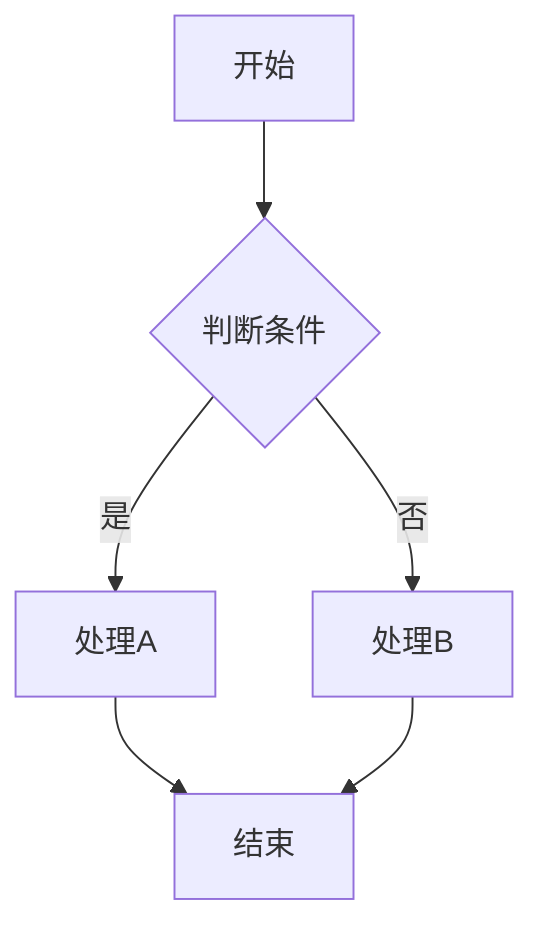
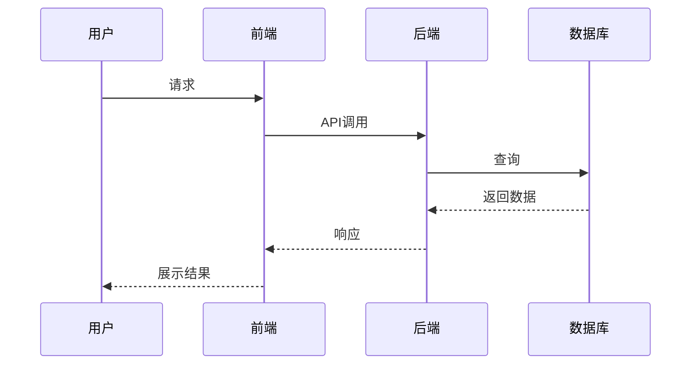

# {{产品名称}} 产品需求文档

## 1. 背景

### 1.1 业务背景
描述当前的业务挑战和问题

### 1.2 产品领域目标
为哪些用户/场景/问题提供什么解决方案

### 1.3 产品现状
- 历史迭代与本次需求的关系
- 当前系统的不足之处

## 2. 目标

### 2.1 上级产品目标
回顾产品领域的整体目标

### 2.2 本次迭代目标
明确定义：
- 时间范围
- 范围边界
- 预期行动
- 预期结果
- 价值体现
- 衡量方法

## 3. 解决方案

### 3.1 业务流程（必需）
使用 Mermaid 语法绘制流程图：

### 3.2 用户流程（可选）
- 界面导航路径
- 使用场景示例

### 3.3 需求列表（必需）

| 产品模块 | 需求名称 | 需求描述 | 优先级 |
|---------|---------|---------|--------|
| 模块A | 需求1 | 描述... | P0 |
| 模块B | 需求2 | 描述... | P1 |

## 4. 详细需求描述

### 4.1 [功能名称]

**描述**
详细功能描述，包括：
- 业务逻辑
- 技术实现要点
- 特殊注意事项

**输入项**
- 参数1：描述
- 参数2：描述

**输出项**
- 返回结果描述
- 副作用说明

**交互演示**（可选）
具体操作示例

### 4.2 [功能名称]
（同上结构）

## 5. 数据需求（可选）

### 5.1 数据埋点需求
需要采集的用户行为数据和系统性能数据

### 5.2 业务报表需求
需要生成的业务报表和数据分析需求

## 6. 风险管理

### 6.1 安全需求（可选）
数据传输加密、访问控制等安全措施

### 6.2 隐私需求（可选）
用户隐私保护措施和数据脱敏机制

### 6.3 合规需求（可选）
符合相关法规和公司政策的要求

### 6.4 成本需求（可选）
成本评估和资源使用规划

### 6.5 用户满意度需求（可选）
用户支持和培训材料准备

## 7. 上线计划

| 阶段 | 时间 | 范围 | 目标 |
|-----|------|------|------|
| 预发布 | | 内测环境 | |
| 内部Beta | | 部分业务团队 | |
| 外部Beta | | 真实用户 | |
| 全量发布 | | 所有用户 | |

## 8. 附录（可选）

### 8.1 概念说明
文档中涉及的专业术语和概念解释

### 8.2 技术实现细节
关键技术方案的详细描述

### 8.3 数据流程
使用序列图展示完整的数据处理流程

